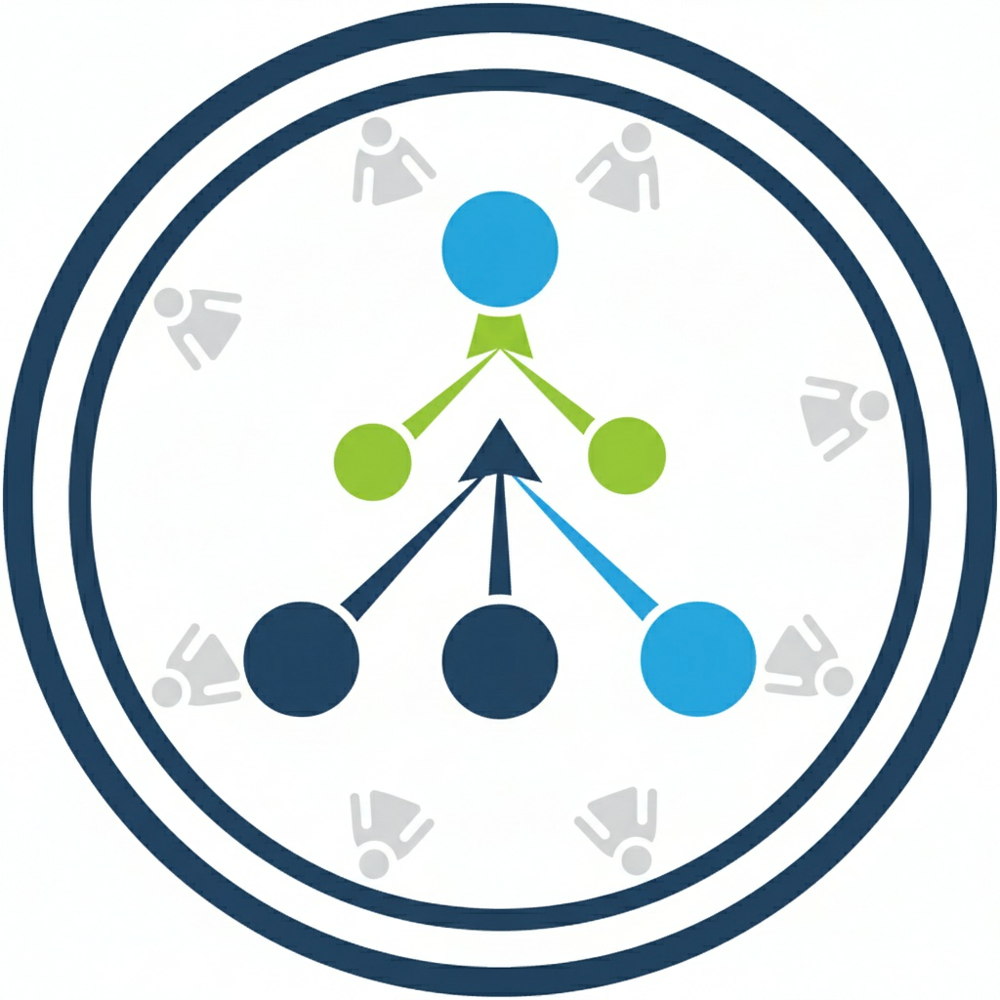
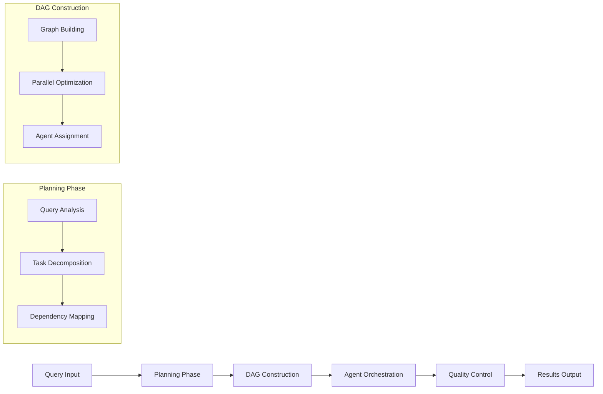

# Dagent

> **Multi-agent orchestration framework for complex query execution**

Dagent decomposes complex queries into executable DAGs and coordinates specialized agents for efficient parallel execution with built-in quality control.

<div align="center">
  

  *Multi-agent DAG execution with parallel task coordination and judge-based quality control*
</div>

---

## Overview

Dagent implements a sophisticated multi-agent system that automatically:
- **Decomposes complex queries** into atomic, parallelizable tasks
- **Builds execution graphs** with optimal dependency resolution
- **Orchestrates specialized agents** with domain-specific tooling
- **Enforces quality control** through actor-critic evaluation loops
- **Manages context flow** between interdependent operations

### Core Capabilities

| Component | Function | Implementation |
|-----------|----------|----------------|
| **Planner** | Query decomposition | LLM-based task analysis with dependency mapping |
| **DAG Builder** | Graph construction | Parallel execution optimization with constraint solving |
| **Kernel** | Agent orchestration | Concurrent task scheduling with context management |
| **Judge** | Quality control | Actor-critic loops with retry mechanisms |
| **Tools** | Domain integration | Financial data, web search, file operations |

## Quick Start

### Prerequisites

- Python 3.8+
- API key for at least one LLM provider (OpenAI or Google)
- Exa API key for web search capabilities

### Installation

```bash
# Clone repository
git clone https://github.com/your-username/dagent.git
cd dagent

# Install dependencies
pip install -r requirements.txt

# Configure environment
cp .env.example .env
```

### Configuration

Edit `.env` with your API credentials:

```bash
# Required: AI Model Providers (choose at least one)
OPENAI_API_KEY=sk-your-openai-key-here
GOOGLE_API_KEY=your-google-ai-key-here

# Required: Search API
EXA_API_KEY=your-exa-search-key-here

# Optional: Observability Stack
LANGFUSE_PUBLIC_KEY=pk-lf-your-public-key
LANGFUSE_SECRET_KEY=sk-lf-your-secret-key
LANGFUSE_HOST=https://cloud.langfuse.com
```

### Basic Usage

```python
import asyncio
from src.framework import AgenticDAG

async def main():
    framework = AgenticDAG()

    result = await framework.execute(
        "Analyze Tesla's Q3 performance and generate a comprehensive investment report"
    )

    if result["success"]:
        print(f"✓ Execution completed: {result['summary']['successful_tasks']}/{result['summary']['total_tasks']} tasks")
        # Access detailed results
        for task_id, task_result in result["execution_results"].items():
            print(f"  - {task_id}: {task_result.execution_time:.2f}s")
    else:
        print(f"✗ Execution failed: {result['error']}")

if __name__ == "__main__":
    asyncio.run(main())
```

## Usage

```python
import asyncio
from src.framework import AgenticDAG

async def main():
    framework = AgenticDAG()

    result = await framework.execute(
        "Analyze Tesla's financial performance and create a comprehensive report"
    )

    if result["success"]:
        print(f"Completed {result['summary']['successful_tasks']} tasks")
    else:
        print(f"Failed: {result.get('error')}")

asyncio.run(main())
```

## System Architecture

### Execution Pipeline

Dagent processes queries through a four-stage pipeline with automatic parallelization and quality control:



### Execution Flow

| Stage | Process | Output |
|-------|---------|--------|
| **1. Planning** | LLM analyzes query complexity and domain requirements | Atomic task list with dependencies |
| **2. DAG Build** | Constructs execution graph optimized for parallelism | Node graph with agent profiles |
| **3. Orchestration** | Deploys agents with tools, manages concurrent execution | Task results with context |
| **4. Quality Control** | Judge evaluates outputs, triggers retries as needed | Validated final results |

### Parallel Execution Model

Tasks execute in dependency-respecting rounds with maximum parallelization:

```
Round 1: [Financial_Data_Search] [News_Content_Search] [Analyst_Report_Fetch]
            ↓                           ↓                         ↓
Round 2:                    [Trend_Analysis] ←──────────────────────┘
                                    ↓
Round 3:                   [Report_Generation]
                                    ↓
Round 4:                     [File_Output]
```

### Agent Profiles
Agents are dynamically configured across four dimensions:

- **Task Types**: SEARCH (data retrieval), THINK (analysis), AGGREGATE (synthesis), ACT (file operations)
- **Complexity Levels**: QUICK (2K tokens), THOROUGH (4K tokens), DEEP (6K tokens)
- **Output Formats**: DATA (structured), ANALYSIS (insights), REPORT (documents)
- **Reasoning Styles**: DIRECT (efficient), ANALYTICAL (systematic), CREATIVE (exploratory)

### Judge System
The Actor-Critic architecture implements quality control through:
- Output evaluation against task requirements
- Feedback generation for failed attempts
- Retry orchestration with context injection
- Quality threshold enforcement

## Available Tools

### YFinanceTools
Financial data interface providing:
- Real-time and historical stock prices
- Company fundamentals and financial statements
- Analyst recommendations and market metrics

### WebSearchTools
Web content retrieval via Exa API supporting:
- News article and research paper search
- Market analysis and sentiment data
- General knowledge and current events

### FileEditorTools
File system operations including:
- File creation, modification, and deletion
- Script generation and execution
- Report formatting and output

## Technical Implementation

### Context Engineering
The system maintains execution context through:
- **Dependency Resolution**: Automatic context propagation between dependent tasks
- **State Tracking**: Global state management for file modifications and system changes
- **Token Optimization**: Context filtering to minimize LLM token consumption

### Parallel Execution
The kernel implements concurrent task execution with:
- Round-based scheduling for dependency satisfaction
- Exception isolation preventing cascade failures
- Resource management for tool allocation

### Error Handling
Robust error recovery through:
- Task-level retry with judge feedback integration
- Graceful degradation for partial failures
- Comprehensive logging and debugging output

## Development

### Project Structure
```
dagent/
├── src/
│   ├── framework.py          # Main orchestration interface
│   ├── planner/              # Query decomposition and planning
│   ├── dag/                  # Graph construction and optimization
│   ├── kernel/               # Execution engine and agent management
│   ├── tools/                # Tool implementations
│   └── utils/                # Shared utilities
├── main.py                   # Example implementation
└── requirements.txt          # Dependencies
```

### Extending Functionality
New tools can be integrated by:
1. Extending `BaseAgnoTool` interface
2. Registering in the tool registry
3. Updating planner tool selection logic

## Debugging

Generated execution plans are saved to `generated_plan.json` containing:
- Task decomposition rationale
- Dependency graph structure
- Agent profile assignments
- Tool allocation decisions

Monitor execution through real-time logging of:
- Task scheduling and parallel execution
- Judge evaluations and retry attempts
- Context flow between dependent tasks

## Contributing

See [CONTRIBUTING.md](CONTRIBUTING.md) for development guidelines and contribution process.

## License

MIT License - see [LICENSE](LICENSE) for details.